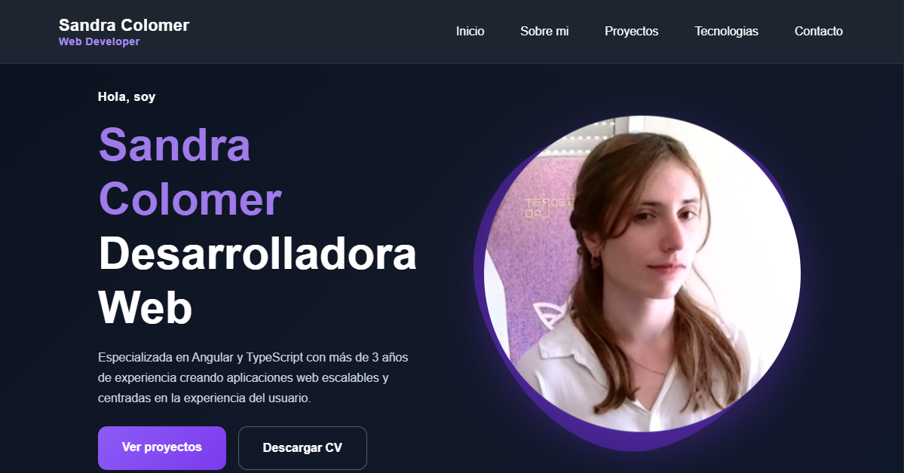
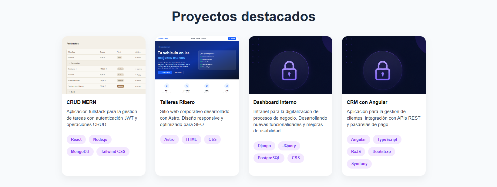
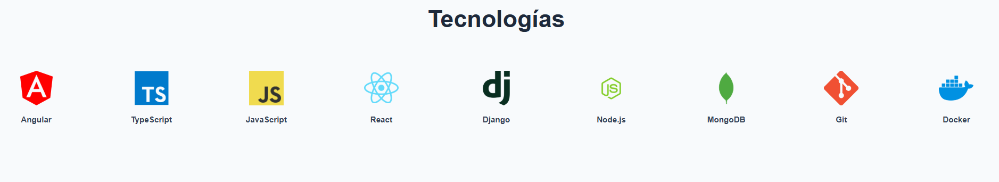

# 🌐 Portfolio - Sandra Colomer

Portfolio personal desarrollado con React donde muestro mi experiencia como desarrolladora Front-end, los proyectos más relevantes y las tecnologías con las que trabajo.

## 🚀 Demo

🔗 https://portafolio-yivz.vercel.app/

## 🛠️ Tecnologías

- React
- CSS Modules
- Tailwind CSS
- React Icons
- Lucide React
- Vite

## 📸 Capturas

### Inicio



### Proyectos



### Tecnologías



## 📂 Estructura del proyecto

```text
src
│
├── assets
│   ├── profile
│   ├── projects
│   └── technologies
│
├── components
│   ├── layout
│   ├── ui
│   ├── AboutMe.jsx
│   ├── Hero.jsx
│   ├── Projects.jsx
│   └── Technologies.jsx
│
├── Home.jsx
├── index.css
└── main.jsx
```

## ⚙️ Instalación

Clona el repositorio:

```bash
git clone https://github.com/Sandra96C/portfolio.git
```

Entra en la carpeta:

```bash
cd portfolio
```

Instala las dependencias:

```bash
npm install
```

Ejecuta el proyecto:

```bash
npm run dev
```

## 📦 Build

```bash
npm run build
```

## 👩‍💻 Sobre mí

Soy desarrolladora Web especializada en Angular y TypeScript, actualmente ampliando conocimientos en React y desarrollo Full Stack.

Me apasiona crear aplicaciones modernas, intuitivas y escalables, cuidando tanto la experiencia de usuario como la calidad del código.

## 📫 Contacto

📧 **Email:** 3496sandra@gmail.com

💼 **LinkedIn:** https://linkedin.com/in/TU-USUARIO

💻 **GitHub:** https://github.com/Sandra96C
